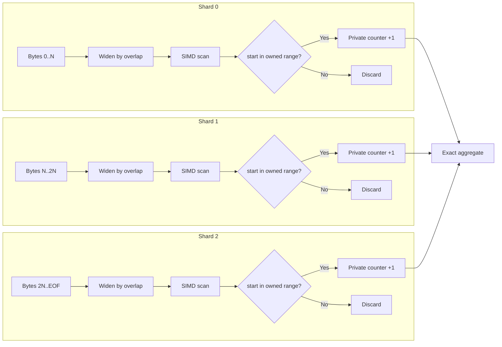
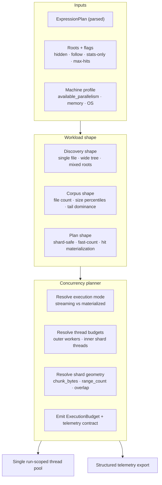

<div align="center">

# Intelligent {Expressions}

**A Rust search engine for local-first retrieval workloads, built around byte-range sharding and a planner that compiles every query to the narrowest exact execution path.**

[](https://github.com/savageops/iEx/actions/workflows/build-native-binaries.yml)
[](https://github.com/savageops/iEx/releases/latest)
[](https://iex.run)
[](https://www.rust-lang.org/)
[](./LICENSE)

[Site](https://iex.run) · [Releases](https://github.com/savageops/iEx/releases/latest) · [Docs](https://iex.run/docs)

</div>

---

## Overview

iex is a Rust-first search engine designed for the workload class that dominates local agentic systems: a single machine reading a single corpus on behalf of a model that has zero patience and limited context. The engine targets two structural problems that conventional file-level parallel search engines do not solve:

1. **Tail dominance.** When one file holds the majority of corpus byte volume, file-level parallelism collapses to single-threaded execution.
2. **Plan opacity.** Most engines return a regex and a result; they do not expose the execution machine the query was lowered to, or the cost terms the planner used to choose it.

iex addresses the first through byte-range sharding inside a single file, and the second through a planner-first architecture in which every query produces a structured execution plan that can be inspected, measured, and reasoned about by the calling agent.

The repository's stated performance target is to beat ripgrep on transparent benchmark suites. Promotion of the canonical binary requires that a candidate beat an immutable snapshot of the current binary on the exact suite under interleaved measurement, and the suite itself is the official ripgrep benchsuite. The benchmark contract is documented in [`tools/reports/`](tools/reports/) and is not optional.

---

## Quick start

```sh
cargo install iex-cli

# rg-style ingress for simple queries
ix timeout .
ix -F -i "session timeout" .
ix -e timeout -e error .

# Native predicate language with structured output
ix search "lit:error && re:\btimeout\b" . --json

# Count-only mode (no hit payload)
ix search "re:CVE-\d{4}-\d{4,6}" . --stats-only --json

# Hit records only — same engine, narrower contract
ix matches "lit:SearchConfig" crates

# Native file inspection for agent code-reading
ix inspect crates/iex-cli/src/main.rs --range 40:80
ix inspect --expr "lit:SearchConfig" crates --context 2 --json

# Inspect the execution plan a query compiles to
ix explain "lit:breach && lit:auth"
```

Pre-built binaries for Windows, Linux, and macOS are published on [Releases](https://github.com/savageops/iEx/releases). The Cargo crate is `iex-cli`; the operator-facing binary is `ix` to keep shell usage short and avoid PowerShell's built-in `iex` alias.

---

## Command surface

iex exposes a deliberately narrow set of commands. Each is an entry point into the same engine; they differ in the output contract, not the matcher.

| Command | Purpose |
| --- | --- |
| `ix search` | Full search with hits, stats, and structured output |
| `ix matches` | Hit records only — same engine, leaner contract |
| `ix inspect` | Native file windowing and match context for agent code-reading |
| `ix explain` | Returns the execution plan a query compiles to, before running it |

### rg-shaped ingress compatibility

For interactive use and operator muscle memory, iex accepts a narrow ripgrep-shaped ingress and lowers it into the canonical search path:

| Flag | Behavior |
| --- | --- |
| `ix PATTERN [PATH]...` | Positional pattern, defaults to current directory |
| `ix -e PATTERN` | Explicit pattern, repeatable |
| `ix -F` | Fixed-string match |
| `ix -i` | Case-insensitive |
| `ix -j` / `--json` | Structured JSON output |
| `ix -n` | No-op (line numbers always present in structured output) |
| `ix --hidden` | Include hidden files |

Anything outside this subset returns a guided non-zero error rather than emulating full ripgrep behavior. The compatibility layer exists to remove ingress friction; iex is not a ripgrep clone.

### Developer inspection

`ix inspect` replaces fragile shell pipelines (`head | tail | sed`) with native Rust contracts:

| Workflow | Command |
| --- | --- |
| First N lines | `ix inspect file --total-count 40` |
| Skip then take | `ix inspect file --skip 120 --limit 30` |
| Sed-style print range | `ix inspect file --range 40:80` |
| Match context | `ix inspect --expr "lit:SearchConfig" crates --context 2` |
| Structured excerpts | `ix inspect --expr "re:TODO\|FIXME" crates --context 1 --json` |

Inspection is read-only; mutation is out of scope. Detailed schema in [`docs/developer-inspection-command-surface.md`](docs/developer-inspection-command-surface.md).

---

## Expression language

iex uses an explicit predicate syntax with native boolean composition. The plan is compiled once at parse time and is immutable for the duration of execution.

| Predicate | Semantics | Example |
| --- | --- | --- |
| `lit:` | Substring containment | `lit:error` |
| `prefix:` | Line-anchored prefix | `prefix:WARN` |
| `suffix:` | Line-anchored suffix | `suffix:.json` |
| `re:` | Rust regex with narrow fast paths | `re:\btimeout\b` |

```
A && B    conjunction — all predicates hold on the same line
A || B    disjunction — any predicate holds
```

Regex follows the current Rust `regex` syntax contract. Look-around and backreferences are not part of the shipped engine surface — both classes of feature break the predictability guarantees the planner depends on.

`ix explain` returns the structured plan a query compiles to. This is the primary tool for understanding why a query is fast or slow before issuing it. Plans are stable across runs and machine-readable.

---

## Architecture

The engine is composed of four layers, each with a narrow ownership contract:

1. **Pattern lowering** — HIR analysis classifies the query into the narrowest exact execution machine that preserves Rust regex semantics.
2. **Concurrency planner** — workload shape, machine profile, and plan readiness determine execution mode and shard geometry before any worker starts.
3. **Byte-range sharding** — when a single file dominates corpus volume, the file is partitioned into disjoint owned byte ranges with widened read windows for boundary safety.
4. **Telemetry** — every run exports a structured stats block including thread budget, shard activation, geometry, and slowest-file attribution.

### Byte-range sharding

File-level parallelism is structurally insufficient when a single file holds the majority of corpus bytes. A 3 GB file with 31 sibling files in a 32-thread machine has 31 idle threads while one thread scans the giant file serially. This is the dominant tail-cost surface in observability dumps, JSONL memory stores, kernel source trees, and any corpus where one artifact is materially larger than the rest.

iex partitions the dominant file into disjoint owned byte ranges. Each Rayon worker reads a widened window (its owned range plus a boundary overlap) to ensure boundary-spanning matches remain visible. Each match is credited exclusively to the shard whose owned range contains the match's true start byte.



Three failure modes are eliminated together by co-resolving thread budget with shard geometry:

- **Fake parallelism.** When thread count exceeds useful range count, workers starve. The planner caps `shard_workers = min(threads, ranges)`.
- **Undersized shards.** When chunk bytes drop below scheduler overhead, parallelism is a net loss. A regime-based floor enforces minimum chunk size: 16 MB for medium-large files, 64 MB for dominant giant files.
- **Work-stealer starvation.** When ranges-per-worker drops below 2, Rayon has no steal candidates. Geometry is solved with `R / workers >= 2` before any worker runs.

Per-shard counters are cache-line aligned to prevent false sharing and reduce once at completion. The aggregate is exact: throughput comes from geometry, exactness from ownership.

### Concurrency planner

The planner ingests the parsed `ExpressionPlan`, corpus shape signals, and `std::thread::available_parallelism()` to emit an `ExecutionBudget` that governs thread allocation, execution mode, and shard geometry for the run. Outer worker count and inner shard count are co-resolved to prevent nested oversubscription across the single run-scoped pool.



Execution mode is selected from corpus geometry, not configured by the operator:

| Mode | Activation | Telemetry |
| --- | --- | --- |
| Streaming pipeline | stats-only on wide trees | `discovery_ms`, `scan_ms`, channel depth |
| Materialized scan | hit-bearing search on wide trees | `phase_ms`, `slowest_files`, dedupe stats |
| Geometric sharding | single file dominates corpus volume | `shard_ms`, `combine_us`, `range_count`, `chunk_bytes` |

Streaming pipelines apply backpressure through `crossbeam`'s bounded channel capacity to prevent memory accumulation on wide artifact trees. Discovery and scan overlap in wall-clock time, eliminating the full path-list materialization tax.

### Pattern lowering

Regex planning is a lowering step, not a second engine. `regex-syntax` HIR analysis classifies the narrowest exact machine that preserves the Rust regex contract:

| Machine | Implementation | Activation |
| --- | --- | --- |
| `PlainLiteral` | `memmem` over bytes | whole-pattern literal |
| `AsciiCaseFoldLiteral` | specialized ASCII case-fold searcher | ASCII literal under `(?i)` |
| `WordBoundaryLiteral` | `memchr` + boundary checks | literal-equivalent `\b...\b` |
| `LiteralAlternates` | `aho-corasick` Teddy backend | short literal alternation |
| `FixedWidthBytesRegex` | `regex::bytes` fast-count path | non-ASCII `(?i)` literal-equivalent regex with stable byte width |
| `RegexDecomposition` | whole-buffer literal discovery, optional context gate, line recovery, full `regex::bytes` confirm | stats-only regex with one strong required literal and no narrower fast path |
| Generic bytes regex | `regex::bytes` on canonical byte-mode loop | fallback |

The `AsciiCaseFoldLiteral` path executes `(byte | 0x20) == (pattern | 0x20)` in a single `vpternlogd` cycle on AVX-512. Opmask registers (`k0`–`k7`) yield per-byte results directly, eliminating the AVX2 `movemask` extraction roundtrip that caps standard case-fold throughput at 1–3 GB/s.

The Teddy SIMD backend (ported from Intel Hyperscan) activates via `.packed(Some(true))` on `AhoCorasickBuilder`. For `LiteralAlternates` patterns under 64 short literals it runs 2–10× faster than standard automaton traversal.

`RegexDecomposition` is intentionally narrow: it activates only when the planner can prove one strong required literal, no better fast path already owns the pattern, and candidate-line volume stays below the bailout ceiling. This is not a generic regex prefilter story.

### Byte ingress tiers

Before the planner activates, ingress commits to a file loading strategy. The thresholds are constants in `engine.rs`, not aspirational tiers:

| Tier | Bound | Strategy | Rationale |
| --- | --- | --- | --- |
| Tiny | < 16 KiB | inline stack buffer | avoid heap allocation for very small files |
| Small | ≤ 256 KiB | `Vec<u8>` full read | cheap full-file ownership |
| Large | > 256 KiB | `memmap2` mapping | hand the scan kernel a slice without copying |

Binary payloads are rejected on a null-byte sniff before the line scanner runs.

---

## Benchmark contract

iex maintains three benchmark surfaces. None is optional.

```
canonical external baseline   →  npm run bench:report   →  CSV in tools/reports/bench/
live operator diagnostics     →  npm run bench:loop     →  JSONL in tools/reports/live-metrics/
exact binary proof            →  immutable snapshots in tools/reports/candidate-compare/
```

**Promotion rule.** A new build does not replace its predecessor unless:

1. The current canonical or live binary is snapshotted to a timestamped path.
2. The candidate is compared against that exact snapshot on the exact workload.
3. Suite-level proof is neutral or better — never regressive.

Only then does the loop restart on the new immutable snapshot. The rule applies to every engine change, including changes that pass unit tests, including changes that improve a single motivating lane. A motivating lane win that introduces a guard regression elsewhere is not a promotion.

### Current proof — Windows

Captured in `tools/reports/candidate-compare/110-ix-current-vs-installed-20260427-233905/summary.json`:

| Metric | Result |
| --- | --- |
| Current build | `target/release/ix.exe` |
| Predecessor comparator | `C:\Users\Savage\AppData\Local\Programs\iEx\bin\iex.exe` |
| **Versus ripgrep** | **12/12 wins** on the three-sample dashboard suite |
| Versus installed predecessor | 9/12 wins |
| Focused recheck | `suite-en-alternates` green at 0.9679× versus installed |
| Confirmed loss frontier | `suite-linux-no-literal` (1.0974×), `suite-linux-word` (1.0286×) |
| Active cost center | Linux scan lanes, 144 MB dominant targeted bytes |

### Live telemetry fields

Every benchmark run exports:

- `iexMs`, `iexCliMs`, `iexProcessOverheadMs` — engine, CLI, and process-overhead timing
- `phaseMs`, `slowestFiles`, `concurrency` — phase breakdown and execution metadata
- `regexDecomposition` — eligible / count / bailout / candidate-line attribution for decomposed regex lanes
- `competitors.ripgrep`, optional `competitors.iex_previous` — head-to-head measurement against the predecessor

```sh
npm run bench:report
npm run bench:loop
npm run bench:once -- --expression "re:\\w+\\s+Holmes\\s+\\w+" --corpus ".refs/ripgrep/benchsuite/subtitles/en.sample.txt"
```

---

## Target workloads

iex is designed for corpora where conventional engines hit a structural ceiling:

- **Local agent retrieval** — JSONL memory stores, exported session transcripts, tool execution artifacts, multi-run evaluation dumps
- **Observability and traces** — structured logs, distributed traces, event queues, crash captures
- **Forensic and incident response** — exact match counts with reproducible results across evidence-heavy corpora
- **Post-uniform-tree codebases** — vendor-saturated monorepos, generated trees, lockfile-heavy repositories, mixed source-and-build roots
- **Unstructured accumulations** — scraped corpora, archived exports, ML output stores, notebook dumps with pathological tail-file distributions

The common thread is a tail-dominant byte distribution — the workload class where byte-range sharding is the difference between a usable matcher and a single-threaded one.

---

## Repository

| Path | Concern |
| --- | --- |
| `crates/iex-core` | Planner, scan kernel, shard geometry, telemetry |
| `crates/iex-cli` | CLI surface (`search`, `matches`, `inspect`, `explain`) |
| `crates/iex-bench` | Benchmark instrumentation |
| `docs/` | Public operator documentation |
| `tests/materialized` | Contract and tooling tests |
| `tools/reports/` | Benchmark outputs and differentials |
| `dashboard/` | Live benchmark loop |
| `.refs/` | Pinned competitor and corpus reference clones |
| `.docs/iex-v2-crown-jewel.md` | Architecture decisions and benchmark doctrine |

**Read next:**
- `crates/iex-core/src/engine.rs` — scan engine, concurrency planner, shard geometry
- `crates/iex-core/src/expr.rs` — expression lowering, fast-path machine classification
- `.docs/iex-v2-crown-jewel.md` — benchmark doctrine and promotion criteria
- `.docs/project-distill-2026-04-27.md` — current cold-start architecture and proof state

---

## License

[MIT](./LICENSE)
