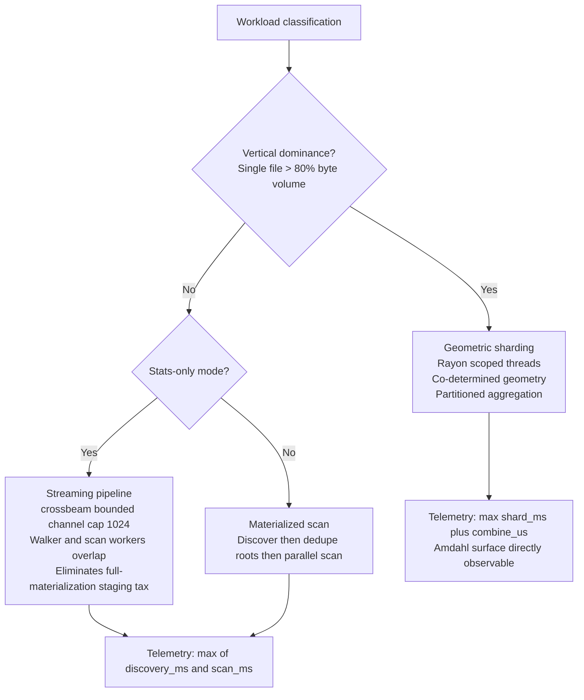
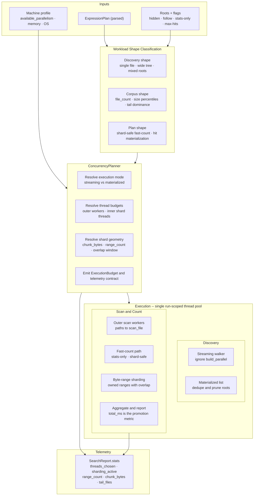
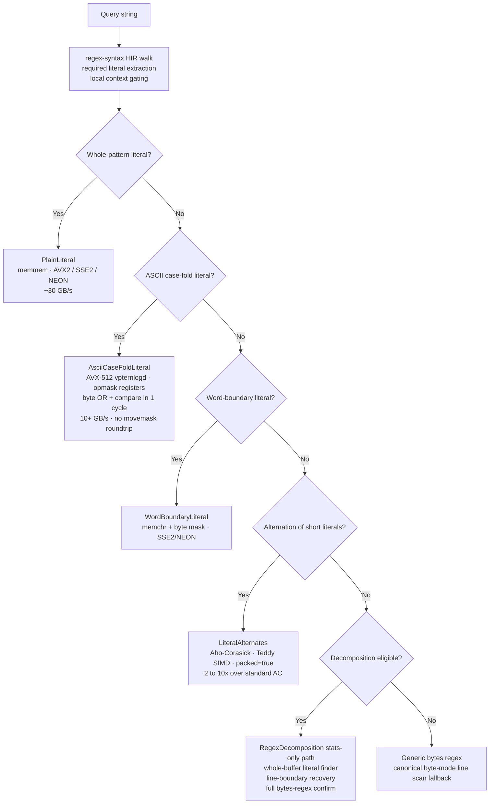
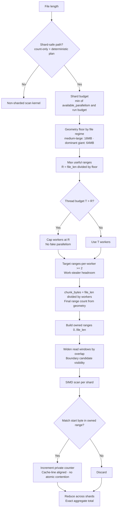
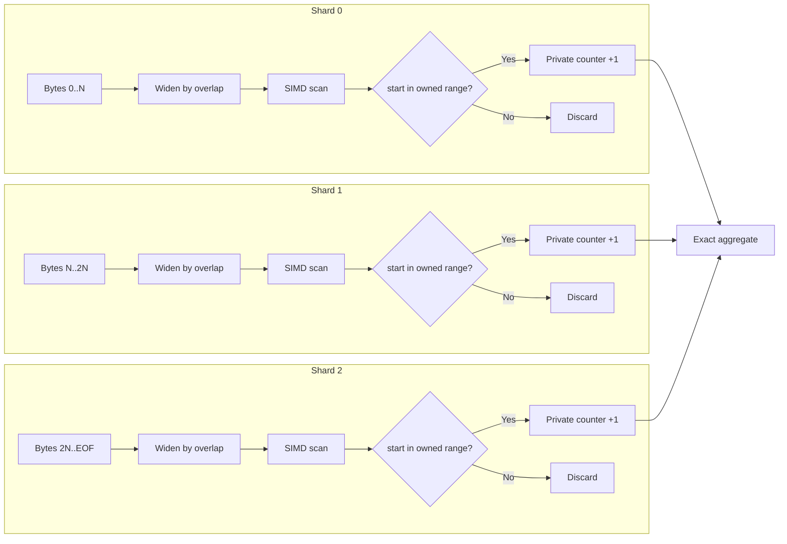
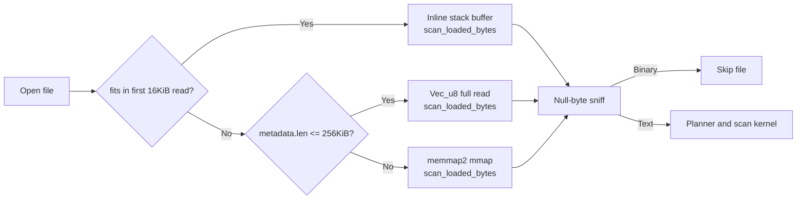

<div align="center">

# IX

**Rust search CLI and benchmark platform with workload-aware execution and proof-first performance governance.**

*Routes literal and regex searches through the cheapest exact path it can prove, then measures every performance slice against immutable baselines before promotion.*

---

[](https://github.com/savageops/iEx/actions/workflows/build-native-binaries.yml)
[](https://github.com/savageops/iEx/releases/latest)
[](https://iex.run)
[](https://www.rust-lang.org/)
[](./LICENSE)

[Site](https://iex.run) · [Releases](https://github.com/savageops/iEx/releases/latest) · [Docs](https://iex.run/docs)

</div>

---

IX v2 is a Rust-first search engine plus benchmark harness. The current core routes work between materialized scan, `--stats-only` streaming dispatch, and shard-safe large-file fast count for eligible lanes. Regex execution stays inside the Rust `regex` / `regex::bytes` stack, with planner-owned fast paths for literal-equivalent shapes and a decomposed candidate path for eligible stats-only regex workloads.

The repo target is explicit: beat ripgrep on transparent benchmark suites. The operator contract is just as important as the matcher contract: `bench:report` is the raw external provenance surface, `bench:loop` is the live diagnostics feed, and every promotion must beat an immutable current binary snapshot before the loop moves.

---

## Quick start

```sh
cargo install iex-cli

# Agent-friendly rg-style ingress for simple searches
ix timeout .
ix -F -i "session timeout" .
ix -e timeout -e error .

# Structured JSON output
ix search "lit:error && re:\btimeout\b" . --json

# Count-only mode, maximum throughput, no hit payload
ix search "re:CVE-\d{4}-\d{4,6}" . --stats-only --json

# Hit records only, same search engine as `ix search`
ix matches "lit:SearchConfig" crates

# Native file windows and match context for agent code-reading
ix inspect crates/iex-cli/src/main.rs --range 40:80
ix inspect --expr "lit:SearchConfig" crates --context 2 --json

# Inspect the execution path a predicate compiles to
ix explain "lit:breach && lit:auth"
```

**Binaries (no Rust required):** [github.com/savageops/iEx/releases](https://github.com/savageops/iEx/releases)

---

## rg-style ingress compatibility

`ix search`, `ix matches`, `ix inspect`, and `ix explain` are the canonical command surface for the IX engine. The Cargo package remains `iex-cli`; the operator-facing binary is `ix` so shell usage stays short and avoids PowerShell's built-in `iex` alias. For agent-friendly local search, IX also accepts a narrow ripgrep-shaped ingress layer and lowers it into the same native search path.

- `ix PATTERN [PATH]...`
- `ix -e PATTERN [PATH]...`
- `ix -F`
- `ix -i`
- `ix -j`
- `ix -n` as a no-op
- `ix --json`
- `ix --hidden`

If a request falls outside that subset, IX returns a guided non-zero error instead of trying to emulate full ripgrep behavior.

---

## Developer inspection

`ix inspect` replaces common shell-specific code-reading fragments with native Rust contracts:

| Workflow | IX command |
|---|---|
| First N lines | `ix inspect file --total-count 40` |
| Skip then take | `ix inspect file --skip 120 --limit 30` |
| Sed-style print range | `ix inspect file --range 40:80` |
| Match context | `ix inspect --expr "lit:SearchConfig" crates --context 2` |
| Structured excerpts | `ix inspect --expr "re:TODO|FIXME" crates --context 1 --json` |

Inspection is read-only. Mutation, replacement, and in-place write behavior belong to a future transform command, not to `inspect`.

Detailed schema and ownership notes: [docs/developer-inspection-command-surface.md](docs/developer-inspection-command-surface.md)

---

## Expression language

An explicit predicate syntax with native boolean composition. The expression plan is compiled once at parse time and does not change during execution. Use `ix explain` to inspect the machine a pattern lowers to before running a search.

| Predicate | Semantics | Example |
|---|---|---|
| `lit:` | Substring containment | `lit:error` |
| `prefix:` | Line-anchored prefix match | `prefix:WARN` |
| `suffix:` | Line-anchored suffix match | `suffix:.json` |
| `re:` | Regex -- lowered to Rust regex text/byte plans plus narrow fast paths | `re:\btimeout\b` |

- `A && B` -- conjunction; all predicates must hold on the same line
- `A || B` -- disjunction; any predicate holds
- `re:` follows the current Rust `regex` syntax contract. Look-around and backreferences are not part of the shipped engine surface.

---

## Benchmark governance

IX keeps three benchmark surfaces aligned:

- canonical external raw baseline: `npm run bench:report` -> `tools/reports/bench/ripgrep-benchsuite-*.csv`
- live operator diagnostics: `npm run bench:loop` -> `tools/reports/live-metrics.jsonl`
- exact binary proof: timestamped `tools/reports/candidate-compare/ix-*.exe` snapshots plus compare artifacts; older `iex-cli-*.exe` snapshots remain immutable historical proof

Current Windows proof snapshot, captured in `tools/reports/candidate-compare/110-ix-current-vs-installed-20260427-233905/summary.json`:
- current build: `target/release/ix.exe`
- installed predecessor comparator: `C:\Users\Savage\AppData\Local\Programs\iEx\bin\iex.exe`
- suite shape: `12/12` wins versus ripgrep and `9/12` wins versus the installed predecessor on the three-sample dashboard suite
- exact focused recheck: `suite-en-alternates` is green at `0.9679x` versus installed; confirmed predecessor-loss frontier is `suite-linux-no-literal` at `1.0974x` and `suite-linux-word` at `1.0286x`
- active cost center: Linux scan lanes, `144,017,913` dominant targeted bytes, no dominant shard activation, top tail files in AMD ASIC register headers

Key live fields:
- `iexMs`, `iexCliMs`, and `iexProcessOverheadMs`
- `phaseMs`, `slowestFiles`, and `concurrency`
- `regexDecomposition` for eligible/count/bailout/candidate-line attribution on decomposed regex lanes
- `competitors.ripgrep` and optional `competitors.iex_previous`

Promotion rule:
1. snapshot the current canonical or live binary
2. compare the candidate against that exact snapshot on the exact workload
3. only then restart the loop on a timestamped immutable snapshot if the suite-level proof is neutral or better

```sh
npm run bench:report
npm run bench:loop
npm run bench:once -- --expression "re:\\w+\\s+Holmes\\s+\\w+" --corpus ".refs/ripgrep/benchsuite/subtitles/en.sample.txt"
```

---

## Target corpus classes

- **Agent retrieval corpora** -- JSONL memory stores, exported session transcripts, tool execution artifacts, multi-run evaluation dumps with heterogeneous record geometry
- **Observability pipelines** -- structured log streams, distributed traces, event queues, crash captures, and wide operational records with non-uniform line geometry at scale
- **Forensic and IR workloads** -- incident reconstruction, malware triage, breach attribution, and evidence-heavy search surfaces requiring exact match counts with reproducible results
- **Post-uniform-tree codebases** -- vendor-saturated monorepos, generated output trees, lockfile-heavy repositories, minified bundle collections, mixed-root searches spanning source and build artifacts
- **Unstructured accumulations** -- scraped document corpora, archived exports, ML output stores, notebook accumulations with pathological tail-file distributions

---

## Architecture

<details>
<summary><strong>Execution mode selection</strong></summary>

IX routes each workload through one of three execution modes based on live corpus telemetry. Mode selection is automatic and requires no configuration.



Streaming pipelines apply backpressure through `crossbeam`'s bounded channel capacity to prevent memory accumulation on wide artifact trees. Discovery and scan overlap in wall-clock time in streaming mode, eliminating the full path-list materialization tax before scanning begins. Both modes export a `stats.concurrency` block: resolved thread counts, shard activation state, range geometry, and chunk sizing.

</details>

<details>
<summary><strong>Concurrency planner</strong></summary>

The planner ingests the parsed `ExpressionPlan`, corpus shape signals, and machine profile from `std::thread::available_parallelism()`, then emits an `ExecutionBudget` governing thread allocation, execution mode, and shard geometry for the full run. No worker starts before those decisions are committed.



Thread budget resolution and geometry resolution are co-scoped. The planner does not allocate outer workers and shard workers independently, which prevents nested oversubscription across the single run-scoped pool. Streaming discovery is currently owned by `ignore`; pool unification is a planned promotion.

</details>

<details>
<summary><strong>Pattern lowering</strong></summary>

Regex planning is a lowering step, not a second engine. `regex-syntax` HIR analysis classifies the narrowest exact machine that preserves the current Rust regex contract. For eligible stats-only byte-mode regexes, the planner can extract a strongest required literal, optionally prove local context such as `word + whitespace + literal + whitespace + word`, then recover line bounds around whole-buffer candidate hits before running full `regex::bytes` confirmation on those lines.



| Machine | Implementation | Activation |
|---|---|---|
| `PlainLiteral` | `memmem` over bytes | whole-pattern literal |
| `AsciiCaseFoldLiteral` | specialized ASCII case-fold searcher | ASCII literal with `(?i)` semantics |
| `WordBoundaryLiteral` | `memchr` plus boundary checks | literal-equivalent `\b...\b` |
| `LiteralAlternates` | `aho-corasick` Teddy backend | short literal alternation families |
| `FixedWidthBytesRegex` | `regex::bytes` fast-count path | narrow non-ASCII `(?i)` literal-equivalent regexes with stable byte width |
| `RegexDecomposition` | whole-buffer literal discovery, optional context gate, line-boundary recovery, full `regex::bytes` confirm | stats-only regexes with one strong required literal and no narrower fast path |
| `Generic bytes regex` | `regex::bytes` on the canonical byte-mode line loop | fallback regex execution |

The `AsciiCaseFoldLiteral` path executes `(byte OR 0x20) == (pattern OR 0x20)` in a single `vpternlogd` instruction cycle. Opmask registers (`k0` through `k7`) produce per-byte results directly, removing the 32-byte to 32-bit `movemask` extraction roundtrip that caps AVX2 case-fold throughput at roughly 1 to 3 GB/s.

The Teddy SIMD backend, ported from Intel Hyperscan, activates via `.packed(Some(true))` on `AhoCorasickBuilder`. For `LiteralAlternates` patterns under 64 short literals it runs 2 to 10x faster than standard automaton traversal.

The decomposition path is intentionally narrower than a generic regex prefilter story. It only activates when the planner can prove one strong required literal, no better fast path already owns the pattern, and candidate-line volume stays below the bailout ceiling.

### Regex decomposition byte sharding

`RegexDecomposition` uses byte sharding as a bounded literal-discovery accelerator, not as arbitrary parallel regex execution. The planner first proves a required literal anchor, then shards only the full-buffer anchor walk. Each shard owns candidate literal starts inside its byte interval and reads a right-extended window so boundary-crossing anchors remain visible without transferring ownership to the neighboring shard. Context gates evaluate against the full haystack, never a truncated shard slice.

After shard-local discovery, IX merges candidate line starts globally with `sort_unstable` plus `dedup`. Full `regex::bytes` confirmation runs once per unique candidate line, preserving serial match-count semantics while avoiding duplicate confirmations when multiple anchors land on one line or a candidate line crosses a shard seam. The current activation gate is intentionally small: stats-only regex decomposition, one outer scan thread, file length at least `64 MiB`, and at most two shard workers.

| Phase | Byte-sharding invariant |
| --- | --- |
| Anchor discovery | Parallel `memmem`-style literal traversal over owned byte intervals. |
| Boundary handling | Right-extended scan windows expose seam-spanning anchors. |
| Candidate ownership | Candidate starts are credited only to the shard-owned byte range. |
| Context filtering | Guards read the original full buffer so lookaround context is exact. |
| Regex confirmation | Unique candidate lines are confirmed once with `regex::bytes`. |

This shifts the hot work from one serial full-buffer anchor pass into owned byte-range passes while keeping regex execution sparse and exact. In the retained `suite-en-surrounding-words` proof, the lane moved from `42.55 ms` on the pre-change snapshot to `27.92 ms` with `39/39` match-count parity. Operators can verify activation through `sharding_enabled`, `max_shard_threads`, `max_shard_ranges`, and the `regexDecomposition` report block.

</details>

<details>
<summary><strong>Shard geometry</strong></summary>

File-level parallelism is structurally insufficient when a single file dominates corpus byte volume. IX shards inward: the file is partitioned into disjoint owned byte ranges, each processed by a dedicated Rayon worker.

Shard geometry is solved before any worker starts. Thread budget, chunk sizing, and range count are co-determined to keep workers fed without generating scheduler overhead on underfeedable shard counts. The planner enforces a minimum chunk floor by file regime (16 MB for medium-large, 64 MB for dominant giant files) and caps worker count at the number of ranges the file can actually sustain.



| Failure Mode | Cause | Resolution |
|---|---|---|
| Fake parallelism | Thread count exceeds useful range count; workers starve | Cap `shard_workers = min(T, R)` |
| Undersized shards | Chunk bytes too small; scheduler overhead exceeds scan throughput | Enforce regime floor: 16 MB (medium), 64 MB (giant) |
| Work-stealer starvation | `ranges_per_worker < 2`; no steal candidates for Rayon | Target `R / workers >= 2` before finalizing geometry |



Workers read widened overlap windows to catch matches spanning range boundaries. Each match is credited exclusively to the shard whose owned range contains the match's true start byte. Per-shard counters are cache-line aligned to prevent false sharing and reduce once at completion.

Throughput comes from geometry. Exactness comes from ownership.

</details>

<details>
<summary><strong>Byte ingress tiers</strong></summary>

Before the planner activates, ingress commits to the current source-of-truth file loading strategy in `engine.rs`. Tiny files stay inline, small files are fully read into memory, and larger files are memory-mapped. Binary payloads are rejected on a null-byte sniff before the line scanner or fast-count path runs.



| Tier | Bound | Strategy | Rationale |
|---|---|---|---|
| Tiny | `< 16 KiB` | stack buffer inline read | avoid heap allocation for very small files |
| Small | `<= 256 KiB` | `Vec<u8>` full read | cheap full-file ownership for small payloads |
| Large | `> 256 KiB` | `memmap2` mapping | hand the scan kernel a byte slice without copying the whole file |

These thresholds are current code constants, not aspirational tiers: `TINY_FILE_INLINE_LIMIT = 16 * 1024` and `SMALL_FILE_INLINE_LIMIT = 256 * 1024`.

</details>

<details>
<summary><strong>Build profiles</strong></summary>

The repo currently defines one explicit performance-focused profile in `Cargo.toml`:

| Profile | Setting | Effect |
|---|---|---|
| `release-lto` | `lto = "fat"` | whole-program optimization across crate boundaries |
| `release-lto` | `codegen-units = 1` | larger inlining surface and slower build, faster proof binary |

Benchmark proof should always record the exact binary path it used instead of assuming a profile name or mutable `target/release/ix.exe` state.
During the command rename, `target/release/ix.exe` is the primary benchmark binary while `target/release/iex-cli.exe` remains available as a compatibility build artifact.

</details>

---

## Install

**Binaries:** [github.com/savageops/iEx/releases](https://github.com/savageops/iEx/releases)

| Platform | Binary |
|---|---|
| Windows | `ix.exe` |
| Linux / macOS | `ix` |

**From source:**

```sh
cargo build --release -p iex-cli
# target/release/ix
```

---

## Repository

| Path | Concern |
|---|---|
| `crates/iex-core` | Planner, scan kernel, shard geometry, telemetry |
| `crates/iex-cli` | CLI surface (`search`, `matches`, `inspect`, `explain`) |
| `crates/iex-bench` | Benchmark instrumentation |
| `docs/` | Public operator documentation |
| `tests/materialized` | Contract and tooling tests |
| `tools/reports/` | Benchmark outputs and differentials |
| `dashboard/` | Live benchmark loop |
| `.refs/` | Pinned competitor and corpus reference clones |
| `.docs/iex-v2-crown-jewel.md` | IX architecture decisions and benchmark doctrine |

**Read next:**
- `crates/iex-core/src/engine.rs` -- scan engine, concurrency planner, shard geometry
- `crates/iex-core/src/expr.rs` -- expression lowering, fast-path machine classification
- `.docs/iex-v2-crown-jewel.md` -- benchmark doctrine and promotion criteria
- `.docs/project-distill-2026-04-22.md` -- current cold-start architecture and proof state

---

## License

[MIT](./LICENSE)
