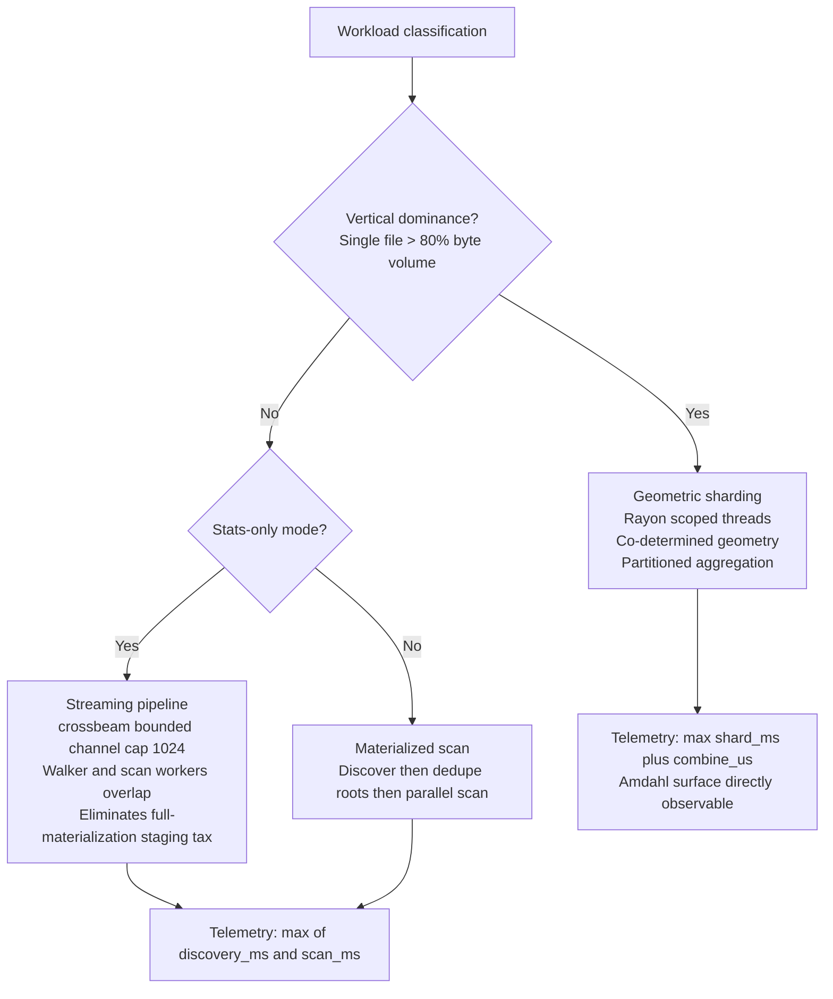
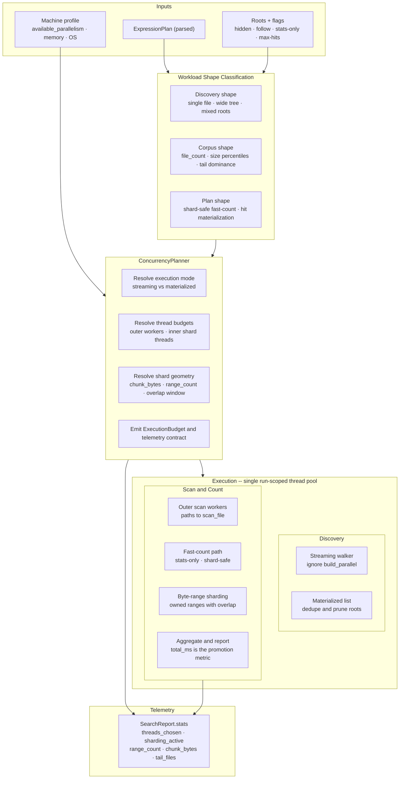
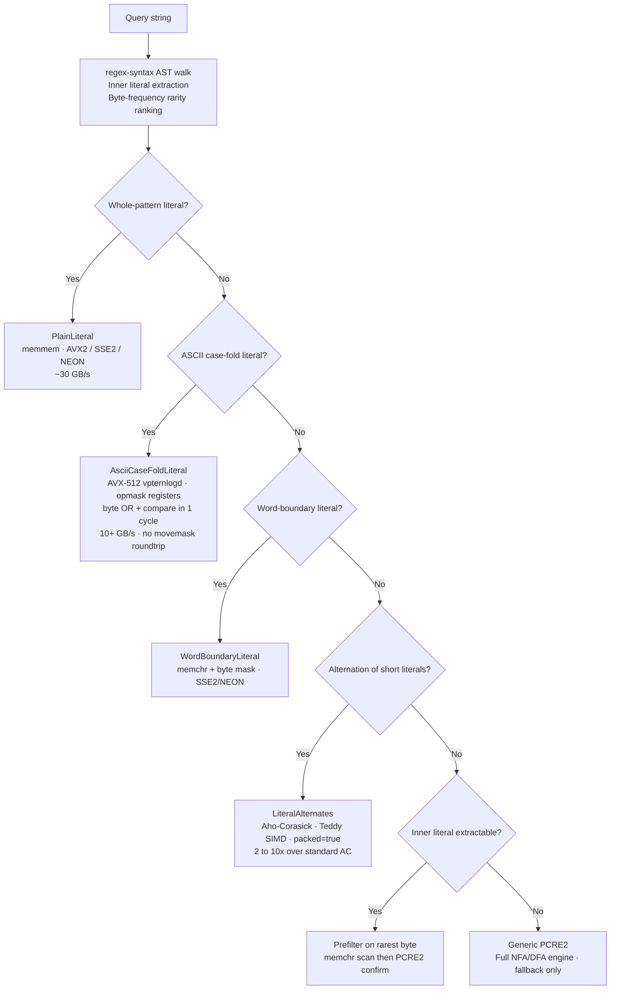
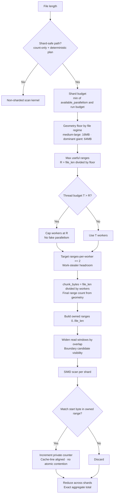
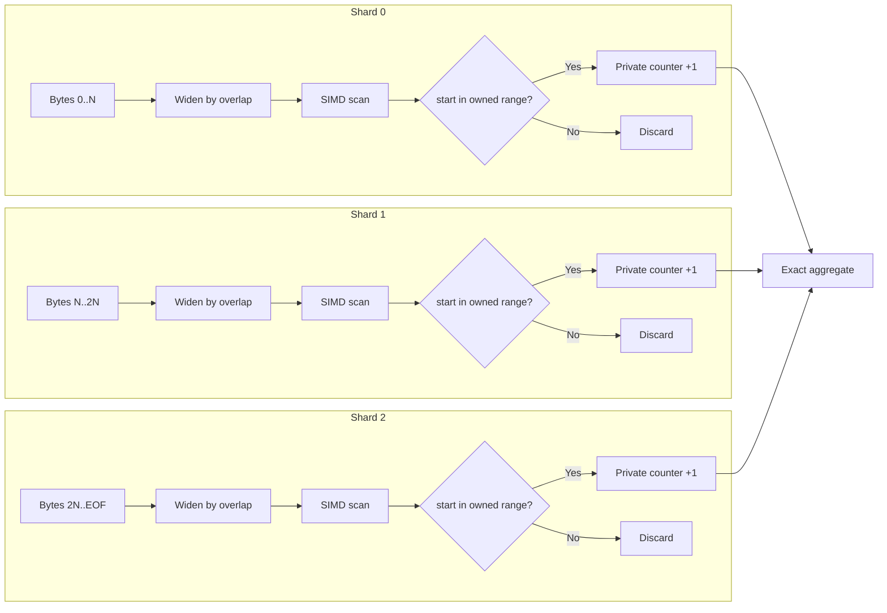
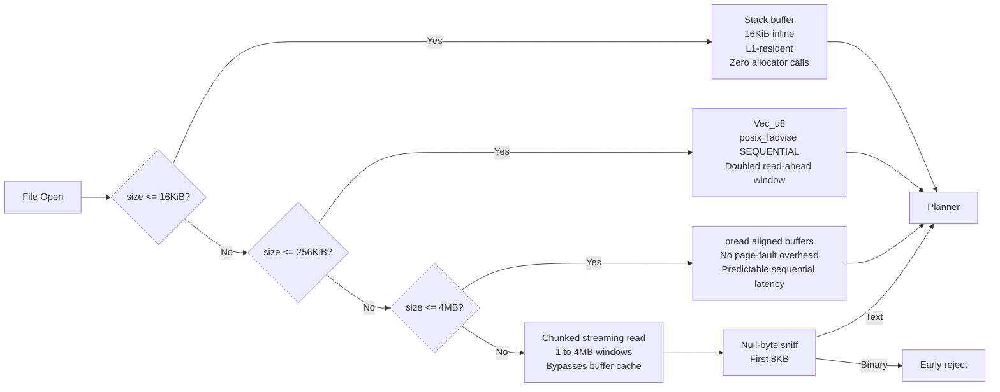

<div align="center">

# iEx

**Rust search kernel with workload-adaptive execution geometry.**

*Validates at 93.5x over ripgrep on PCRE2 prefilter-eligible patterns. Holds throughput across corpus topologies that cause NFA/DFA-based tools to degrade.*

---

[](https://github.com/savageops/iEx/actions/workflows/build-native-binaries.yml)
[](https://github.com/savageops/iEx/releases/latest)
[](https://iex.run)
[](https://www.rust-lang.org/)
[](./LICENSE)

[Site](https://iex.run) · [Releases](https://github.com/savageops/iEx/releases/latest) · [Docs](https://iex.run/docs)

</div>

---

iEx routes each workload to the minimum-cost exact execution path: sequential scan for well-formed trees, streaming pipeline for wide artifact forests, inward byte-range sharding for files that dominate corpus byte volume. On a 40 GB forensic corpus it returned exact match counts across 20 patterns and ran **93.5x faster than ripgrep** on PCRE2 patterns with extractable literal prefilters, and **14.8x faster** on SHA-256 alternation patterns that route through Aho-Corasick with the Teddy SIMD backend active.

Most search tools are built for clean source trees. iEx is built for the rest.

---

## Quick start

```sh
cargo install iex-cli

# Structured JSON output
iex search "lit:error && re:\btimeout\b" . --json

# Count-only mode, maximum throughput, no hit payload
iex search "re:CVE-\d{4}-\d{4,6}" . --stats-only --json

# Inspect the execution path a predicate compiles to
iex explain "lit:breach && lit:auth"
```

**Binaries (no Rust required):** [github.com/savageops/iEx/releases](https://github.com/savageops/iEx/releases)

---

## Expression language

An explicit predicate syntax with native boolean composition. The expression plan is compiled once at parse time and does not change during execution. Use `iex explain` to inspect the machine a pattern lowers to before running a search.

| Predicate | Semantics | Example |
|---|---|---|
| `lit:` | Substring containment | `lit:error` |
| `prefix:` | Line-anchored prefix match | `prefix:WARN` |
| `suffix:` | Line-anchored suffix match | `suffix:.json` |
| `re:` | Regex -- lowered to exact machine or PCRE2 | `re:\btimeout\b` |

- `A && B` -- conjunction; all predicates must hold on the same line
- `A || B` -- disjunction; any predicate holds

---

## Corpus validation

Twenty search patterns against a 40 GB forensic corpus: JSONL session transcripts, IR artifacts, malware analysis records, and configuration remnants from a server-level XMRig compromise with BMC-level persistence artifacts. The corpus exhibited the failure modes iEx is designed for -- dominant tail files, wide-line JSONL records, and multi-root trees from mixed incident sources. iEx returned exact match counts on all 20 patterns.

| Pattern | ripgrep | iEx | Delta |
|---|---|---|---|
| Literal, 40 GB corpus | 7.1 ms | 5.7 ms | 1.3x |
| CVE regex | 53.3 ms | 26.1 ms | 2.0x |
| Malware artifact paths | 71.7 ms | 19.2 ms | 3.7x |
| 4-way conjunction | 77.5 ms | 26.1 ms | 3.0x |
| Multi-root (3x) | 54.8 ms | 16.9 ms | 3.2x |
| SHA-256 `[0-9a-f]{64}` | 886.7 ms | 59.8 ms | **14.8x** |
| PCRE2 negative lookahead | 1970 ms | 21.1 ms | **93.5x** |

The 93.5x gap on negative lookahead reflects ripgrep's full DFA fallback cost against iEx's literal-prefilter-then-confirm path on the same input. SHA-256 routes to `LiteralAlternates` via Aho-Corasick with the Teddy SIMD backend active. Deltas widen with corpus irregularity and narrow toward parity on clean uniform source trees.

Harnesses, differentials, and comparison artifacts: `tools/reports/`. Live benchmark loop: `dashboard/`.

```sh
node tools/scripts/benchsuite-ripgrep.mjs list
```

---

## Target corpus classes

- **Agent retrieval corpora** -- JSONL memory stores, exported session transcripts, tool execution artifacts, multi-run evaluation dumps with heterogeneous record geometry
- **Observability pipelines** -- structured log streams, distributed traces, event queues, crash captures, and wide operational records with non-uniform line geometry at scale
- **Forensic and IR workloads** -- incident reconstruction, malware triage, breach attribution, and evidence-heavy search surfaces requiring exact match counts with reproducible results
- **Post-uniform-tree codebases** -- vendor-saturated monorepos, generated output trees, lockfile-heavy repositories, minified bundle collections, mixed-root searches spanning source and build artifacts
- **Unstructured accumulations** -- scraped document corpora, archived exports, ML output stores, notebook accumulations with pathological tail-file distributions

---

## Architecture

<details>
<summary><strong>Execution mode selection</strong></summary>

iEx routes each workload through one of three execution modes based on live corpus telemetry. Mode selection is automatic and requires no configuration.



Streaming pipelines apply backpressure through `crossbeam`'s bounded channel capacity to prevent memory accumulation on wide artifact trees. Discovery and scan overlap in wall-clock time in streaming mode, eliminating the full path-list materialization tax before scanning begins. Both modes export a `stats.concurrency` block: resolved thread counts, shard activation state, range geometry, and chunk sizing.

</details>

<details>
<summary><strong>Concurrency planner</strong></summary>

The planner ingests the parsed `ExpressionPlan`, corpus shape signals, and machine profile from `std::thread::available_parallelism()`, then emits an `ExecutionBudget` governing thread allocation, execution mode, and shard geometry for the full run. No worker starts before those decisions are committed.



Thread budget resolution and geometry resolution are co-scoped. The planner does not allocate outer workers and shard workers independently, which prevents nested oversubscription across the single run-scoped pool. Streaming discovery is currently owned by `ignore`; pool unification is a planned promotion.

</details>

<details>
<summary><strong>Pattern lowering</strong></summary>

The regex surface is a lowering target. At parse time, the classifier walks the AST via `regex-syntax` to extract inner literal substrings from complex expressions -- `\d+foo\d+` yields `foo` as a required prefilter candidate, ranked by byte-frequency rarity. Each pattern classifies into the minimum-cost exact machine type before reaching the full PCRE2 engine.



| Machine | Implementation | Throughput |
|---|---|---|
| `PlainLiteral` | `memmem`, 128/256-bit vectorized | ~30 GB/s on AVX2 |
| `AsciiCaseFoldLiteral` | AVX-512 `vpternlogd`, opmask registers `k0`-`k7` | 10+ GB/s, no `movemask` roundtrip |
| `WordBoundaryLiteral` | `memchr` + boundary mask | SSE2/NEON |
| `LiteralAlternates` | Aho-Corasick Teddy backend, `packed=true` | 2 to 10x over standard AC |
| Prefilter + confirm | `memchr` on rarest byte then PCRE2 confirm | Eliminates NFA cost on sparse matches |
| `Generic PCRE2` | Full NFA/DFA engine | Fallback only |

The `AsciiCaseFoldLiteral` path executes `(byte OR 0x20) == (pattern OR 0x20)` in a single `vpternlogd` instruction cycle. Opmask registers (`k0` through `k7`) produce per-byte results directly, removing the 32-byte to 32-bit `movemask` extraction roundtrip that caps AVX2 case-fold throughput at roughly 1 to 3 GB/s.

The Teddy SIMD backend, ported from Intel Hyperscan, activates via `.packed(Some(true))` on `AhoCorasickBuilder`. For `LiteralAlternates` patterns under 64 short literals it runs 2 to 10x faster than standard automaton traversal.

</details>

<details>
<summary><strong>Shard geometry</strong></summary>

File-level parallelism is structurally insufficient when a single file dominates corpus byte volume. iEx shards inward: the file is partitioned into disjoint owned byte ranges, each processed by a dedicated Rayon worker.

Shard geometry is solved before any worker starts. Thread budget, chunk sizing, and range count are co-determined to keep workers fed without generating scheduler overhead on underfeedable shard counts. The planner enforces a minimum chunk floor by file regime (16 MB for medium-large, 64 MB for dominant giant files) and caps worker count at the number of ranges the file can actually sustain.



| Failure Mode | Cause | Resolution |
|---|---|---|
| Fake parallelism | Thread count exceeds useful range count; workers starve | Cap `shard_workers = min(T, R)` |
| Undersized shards | Chunk bytes too small; scheduler overhead exceeds scan throughput | Enforce regime floor: 16 MB (medium), 64 MB (giant) |
| Work-stealer starvation | `ranges_per_worker < 2`; no steal candidates for Rayon | Target `R / workers >= 2` before finalizing geometry |



Workers read widened overlap windows to catch matches spanning range boundaries. Each match is credited exclusively to the shard whose owned range contains the match's true start byte. Per-shard counters are cache-line aligned to prevent false sharing and reduce once at completion.

Throughput comes from geometry. Exactness comes from ownership.

</details>

<details>
<summary><strong>Byte ingress tiers</strong></summary>

Before the planner activates, ingress commits to a memory strategy from file size. Each tier eliminates the syscall and allocation overhead of the tier above it for files within its bounds. Binary payloads are rejected on a null-byte sniff before the scan engine activates.



| Tier | Bound | Strategy | Rationale |
|---|---|---|---|
| Tiny | < 16 KiB | Stack buffer, 16 KiB inline | L1-resident, zero allocator calls |
| Small | 16 KiB to 256 KiB | `Vec<u8>` with `posix_fadvise(POSIX_FADV_SEQUENTIAL)` | Amortized syscall cost, doubled kernel read-ahead window |
| Medium | 256 KiB to 4 MB | `pread` with aligned buffers | Avoids `mmap` page-fault overhead on sequential scans |
| Large | > 4 MB | Chunked streaming read, 1 to 4 MB windows | Bypasses buffer cache, feeds scan engine without full materialization |

On Linux NVMe, `io_uring` batch `open+stat+read` replaces the per-file syscall sequence for directory traversal, reducing kernel-crossing overhead on the discovery critical path.

</details>

<details>
<summary><strong>Compiler profile</strong></summary>

The release profile is part of the performance contract. A source build with `target-cpu=native` will outperform distributed binaries on the target microarchitecture, as CI binaries are compiled against the runner's ISA, not the deployment host's.

| Flag | Effect | Observed Gain |
|---|---|---|
| `lto = "fat"` | Whole-program optimization across crate boundaries | 10 to 20% |
| `codegen-units = 1` | Single codegen unit, maximum inlining surface | Combined with LTO |
| `target-cpu = "native"` | Enables AVX-512 and AVX2 intrinsics for the build host | 5 to 15% |
| `panic = "abort"` | Removes unwind tables, smaller binary, improved icache density | Binary size + icache |
| `strip = true` | Strips debug symbols from release binary | Instruction cache utilization |
| PGO via `cargo-pgo` | Profile-guided branch probability data from real workloads | 2 to 15% additional |

</details>

---

## Install

**Binaries:** [github.com/savageops/iEx/releases](https://github.com/savageops/iEx/releases)

| Platform | Binary |
|---|---|
| Windows | `iex.exe` |
| Linux / macOS | `iex` |

**From source:**

```sh
cargo build --release -p iex-cli
# target/release/iex-cli
```

---

## Repository

| Path | Concern |
|---|---|
| `crates/iex-core` | Planner, scan kernel, shard geometry, telemetry |
| `crates/iex-cli` | CLI surface (`search`, `explain`) |
| `crates/iex-bench` | Benchmark instrumentation |
| `tests/materialized` | Contract and tooling tests |
| `tools/reports/` | Benchmark outputs and differentials |
| `dashboard/` | Live benchmark loop |
| `.refs/` | Pinned competitor and corpus reference clones |
| `.docs/iex-v2-crown-jewel.md` | Architecture decisions and benchmark doctrine |

**Read next:**
- `crates/iex-core/src/engine.rs` -- scan engine, concurrency planner, shard geometry
- `crates/iex-core/src/expr.rs` -- expression lowering, fast-path machine classification
- `.docs/iex-v2-crown-jewel.md` -- benchmark doctrine and promotion criteria

---

## License

[MIT](./LICENSE)